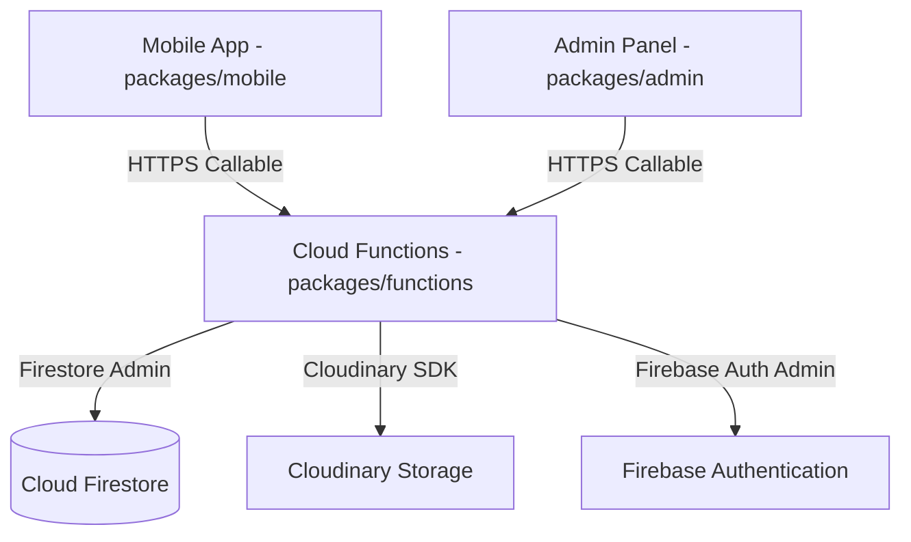

# BazaarBasket — Kirana Store Platform

BazaarBasket is a production-grade Kirana (Indian grocery) store platform built as a TypeScript monorepo using `pnpm` workspaces. It includes a customer-facing mobile application, a store owner web admin panel, shared logic, and a Firebase Cloud Functions backend.

## Platform Architecture



### Monorepo Structure

*   **[`packages/shared`](file:///e:/Avalence/BazaarBasket/packages/shared)**: Shared TypeScript interfaces, Zod validation schemas, business constants, and utilities (currency formatting, date/time calculations, text sanitization, slug generation).
*   **[`packages/functions`](file:///e:/Avalence/BazaarBasket/packages/functions)**: Firebase Cloud Functions (v2) implementing rate-limiting, writing throttles, transactional order placement with idempotency checks, category/product management, user profile updates, and low stock/order state FCM notification triggers. Integrates with the Cloudinary Node SDK.
*   **[`packages/mobile`](file:///e:/Avalence/BazaarBasket/packages/mobile)**: Mobile client for customers built with Expo SDK 51, Expo Router, Zustand stores, and TanStack React Query. Supports OTP-based verification, Google Sign-In, and client-selected delivery slots.
*   **[`packages/admin`](file:///e:/Avalence/BazaarBasket/packages/admin)**: Shop management web dashboard built with Vite, React 18, Tailwind CSS, Zustand, and Recharts. Includes session auto-inactivity timeouts (30 mins) and full order/inventory CRUD capability.

---

## Setup & Getting Started

### Prerequisites

*   **Node.js**: >= 20.0.0 (Recommended: v20 or v24 LTS)
*   **pnpm**: >= 9.0.0
*   **Firebase CLI**: Installed globally (`npm install -g firebase-tools`)

### Installation

Clone the repository and install all dependencies:

```bash
npx pnpm install
```

### Environment Configuration

1.  **Firebase & Cloudinary (Functions)**:
    Create a `packages/functions/.env` file with the following variables:
    ```env
    CLOUDINARY_CLOUD_NAME=your_cloud_name
    CLOUDINARY_API_KEY=your_api_key
    CLOUDINARY_API_SECRET=your_api_secret
    ```

2.  **Web Admin Panel**:
    Create a `packages/admin/.env` file:
    ```env
    VITE_FIREBASE_API_KEY=your_firebase_api_key
    VITE_FIREBASE_AUTH_DOMAIN=your_firebase_auth_domain
    VITE_FIREBASE_PROJECT_ID=your_firebase_project_id
    VITE_FIREBASE_STORAGE_BUCKET=your_firebase_storage_bucket
    VITE_FIREBASE_MESSAGING_SENDER_ID=your_firebase_messaging_sender_id
    VITE_FIREBASE_APP_ID=your_firebase_app_id
    ```

3.  **Mobile App**:
    Create a `packages/mobile/.env` file:
    ```env
    EXPO_PUBLIC_FIREBASE_API_KEY=your_firebase_api_key
    EXPO_PUBLIC_FIREBASE_AUTH_DOMAIN=your_firebase_auth_domain
    EXPO_PUBLIC_FIREBASE_PROJECT_ID=your_firebase_project_id
    EXPO_PUBLIC_FIREBASE_STORAGE_BUCKET=your_firebase_storage_bucket
    EXPO_PUBLIC_FIREBASE_MESSAGING_SENDER_ID=your_firebase_messaging_sender_id
    EXPO_PUBLIC_APP_ID=your_firebase_app_id
    ```

---

## Commands

All scripts are executed from the root using workspace topology orchestration:

| Command | Action |
|---|---|
| `npx pnpm build` | Compile shared logic, web admin panel bundle, and Cloud Functions. |
| `npx pnpm lint` | Run ESLint across all workspace directories. |
| `npx pnpm test` | Execute unit tests via Vitest / Jest. |
| `npx pnpm typecheck` | Run TypeScript Compiler typechecks across the workspaces. |

---

## Verification & Testing

### Running Tests

```bash
npx pnpm test
```

*   Unit tests in `packages/shared` cover validator logic, currency formatting, sanitization, and dates.
*   Unit tests in `packages/functions` verify callable interceptors, rate-limiters, and transaction scenarios.
*   Unit tests in `packages/admin` verify Protected Route guards and auto-logout timers.
