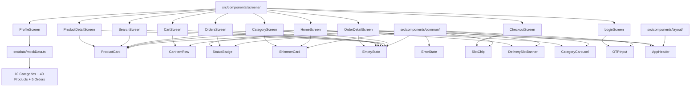

# BazaarBasket — React Native Component Migration Walkthrough

## Summary

Converted all **10 reference screens + 10 reusable components + mock data** from the React web prototype (`src/app/components/`) into production **React Native / Expo / NativeWind** code under `src/components/` and `src/data/`. Created **25 new files**, modified **1 existing file**, deleted **0 files**.

## Architecture



## Changes Made

### Modified (1 file)

| File | Change |
|------|--------|
| [tailwind.config.js](file:///c:/Users/SHREE/OneDrive/Desktop/Avalence/BazaarBasket/mobile/tailwind.config.js) | Added `./src/**/*.{ts,tsx}` to content paths, added `brand` and `status` color tokens |

---

### Created (25 new files)

#### Mock Data
| File | Purpose |
|------|---------|
| [mockData.ts](file:///c:/Users/SHREE/OneDrive/Desktop/Avalence/BazaarBasket/mobile/src/data/mockData.ts) | 10 categories, 40 products (Indian brands), 5 orders, delivery slots, addresses |

#### Common Components (10)
| Component | File | Purpose |
|-----------|------|---------|
| ProductCard | [ProductCard.tsx](file:///c:/Users/SHREE/OneDrive/Desktop/Avalence/BazaarBasket/mobile/src/components/common/ProductCard.tsx) | Product display with image, price, discount badge, add/qty controls |
| CartItemRow | [CartItemRow.tsx](file:///c:/Users/SHREE/OneDrive/Desktop/Avalence/BazaarBasket/mobile/src/components/common/CartItemRow.tsx) | Cart item with image, qty +/−, trash icon |
| StatusBadge | [StatusBadge.tsx](file:///c:/Users/SHREE/OneDrive/Desktop/Avalence/BazaarBasket/mobile/src/components/common/StatusBadge.tsx) | Color-coded order status pill |
| ShimmerCard | [ShimmerCard.tsx](file:///c:/Users/SHREE/OneDrive/Desktop/Avalence/BazaarBasket/mobile/src/components/common/ShimmerCard.tsx) | Skeleton loading with animated opacity |
| EmptyState | [EmptyState.tsx](file:///c:/Users/SHREE/OneDrive/Desktop/Avalence/BazaarBasket/mobile/src/components/common/EmptyState.tsx) | Icon + message + optional CTA |
| ErrorState | [ErrorState.tsx](file:///c:/Users/SHREE/OneDrive/Desktop/Avalence/BazaarBasket/mobile/src/components/common/ErrorState.tsx) | Error message + retry button |
| SlotChip | [SlotChip.tsx](file:///c:/Users/SHREE/OneDrive/Desktop/Avalence/BazaarBasket/mobile/src/components/common/SlotChip.tsx) | Delivery time slot card with availability |
| DeliverySlotBanner | [DeliverySlotBanner.tsx](file:///c:/Users/SHREE/OneDrive/Desktop/Avalence/BazaarBasket/mobile/src/components/common/DeliverySlotBanner.tsx) | Green gradient banner with LinearGradient |
| CategoryCarousel | [CategoryCarousel.tsx](file:///c:/Users/SHREE/OneDrive/Desktop/Avalence/BazaarBasket/mobile/src/components/common/CategoryCarousel.tsx) | Horizontal emoji category scroll |
| OTPInput | [OTPInput.tsx](file:///c:/Users/SHREE/OneDrive/Desktop/Avalence/BazaarBasket/mobile/src/components/common/OTPInput.tsx) | 6-digit input with auto-advance + shake animation |

#### Layout Components (1)
| Component | File | Purpose |
|-----------|------|---------|
| AppHeader | [AppHeader.tsx](file:///c:/Users/SHREE/OneDrive/Desktop/Avalence/BazaarBasket/mobile/src/components/layout/AppHeader.tsx) | Reusable header with back button, safe area, optional actions |

#### Screen Components (10)
| Screen | File | Key Features |
|--------|------|-------------|
| LoginScreen | [LoginScreen.tsx](file:///c:/Users/SHREE/OneDrive/Desktop/Avalence/BazaarBasket/mobile/src/components/screens/LoginScreen.tsx) | Green gradient header, phone input → OTP → auth |
| HomeScreen | [HomeScreen.tsx](file:///c:/Users/SHREE/OneDrive/Desktop/Avalence/BazaarBasket/mobile/src/components/screens/HomeScreen.tsx) | Categories, deals, search bar, slot banner, browse grid |
| CategoryScreen | [CategoryScreen.tsx](file:///c:/Users/SHREE/OneDrive/Desktop/Avalence/BazaarBasket/mobile/src/components/screens/CategoryScreen.tsx) | Subcategory chips, product grid, shimmer |
| SearchScreen | [SearchScreen.tsx](file:///c:/Users/SHREE/OneDrive/Desktop/Avalence/BazaarBasket/mobile/src/components/screens/SearchScreen.tsx) | Debounced search, recent (AsyncStorage), popular categories |
| ProductDetailScreen | [ProductDetailScreen.tsx](file:///c:/Users/SHREE/OneDrive/Desktop/Avalence/BazaarBasket/mobile/src/components/screens/ProductDetailScreen.tsx) | Hero image, qty controls, related products, sticky CTA |
| CartScreen | [CartScreen.tsx](file:///c:/Users/SHREE/OneDrive/Desktop/Avalence/BazaarBasket/mobile/src/components/screens/CartScreen.tsx) | Cart items, promo code, bill summary, checkout button |
| CheckoutScreen | [CheckoutScreen.tsx](file:///c:/Users/SHREE/OneDrive/Desktop/Avalence/BazaarBasket/mobile/src/components/screens/CheckoutScreen.tsx) | 3-step: address → slot → confirmation |
| OrdersScreen | [OrdersScreen.tsx](file:///c:/Users/SHREE/OneDrive/Desktop/Avalence/BazaarBasket/mobile/src/components/screens/OrdersScreen.tsx) | Active/Past tabs with status badges |
| OrderDetailScreen | [OrderDetailScreen.tsx](file:///c:/Users/SHREE/OneDrive/Desktop/Avalence/BazaarBasket/mobile/src/components/screens/OrderDetailScreen.tsx) | 4-step tracker, cancel dialog, delivery partner |
| ProfileScreen | [ProfileScreen.tsx](file:///c:/Users/SHREE/OneDrive/Desktop/Avalence/BazaarBasket/mobile/src/components/screens/ProfileScreen.tsx) | Addresses/About bottom sheets, logout dialog |

#### Barrel Export (1)
| File | Purpose |
|------|---------|
| [index.ts](file:///c:/Users/SHREE/OneDrive/Desktop/Avalence/BazaarBasket/mobile/src/components/index.ts) | Re-exports all components for clean imports |

---

## Verification

- **TypeScript**: All 25 new files compile without errors (`npx tsc --noEmit`)
- The only TS errors are in the pre-existing `src/app/App.tsx` (React web prototype), not in any new code

## Key Design Decisions

| Decision | Rationale |
|----------|-----------|
| `Ionicons` instead of `lucide-react` | Already installed via `@expo/vector-icons`, no new dependency |
| `expo-linear-gradient` for gradients | Already in `package.json`, native gradient support |
| `expo-image` for images | Already in deps, superior caching + `contentFit` API |
| `AsyncStorage` for recent searches | Already in deps, replaces web `localStorage` |
| `Modal` for bottom sheets | React Native built-in, no additional dependency |
| `Alert.alert()` for confirmations | Replaces web `AlertDialog`, native platform dialog |
| Brand green `#22c55e` | Matches reference design exactly |
| NativeWind `className` styling | Matches reference Tailwind classes 1:1 where possible |
| `flex-row flex-wrap` for grids | CSS Grid not available in React Native |
| `Animated` API for shimmer + shake | CSS `@keyframes` not available natively |

## How to Wire Screens

Import from the barrel export and render in your `app/` route files:

```tsx
// Example: app/(tabs)/index.tsx
import { HomeScreen } from '../../src/components';
export default function Home() {
  return <HomeScreen />;
}

// Example: app/product/[id].tsx
import { useLocalSearchParams } from 'expo-router';
import { ProductDetailScreen } from '../../src/components';
export default function ProductDetail() {
  const { id } = useLocalSearchParams<{ id: string }>();
  return <ProductDetailScreen productId={id!} />;
}
```
